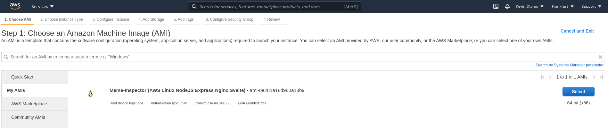
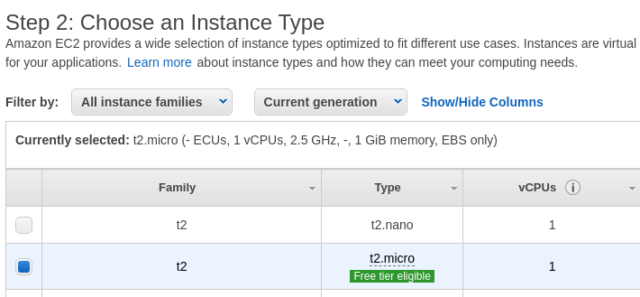
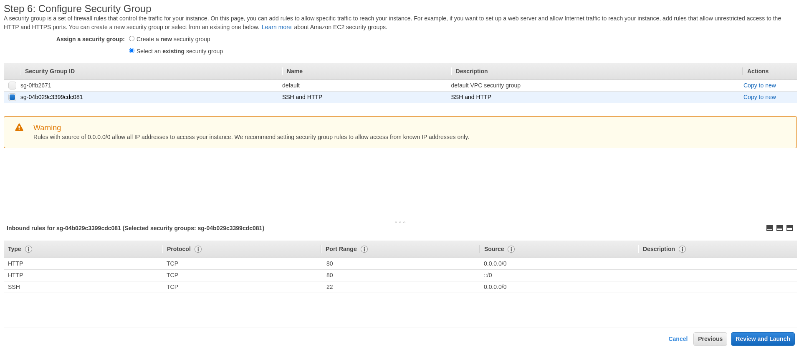
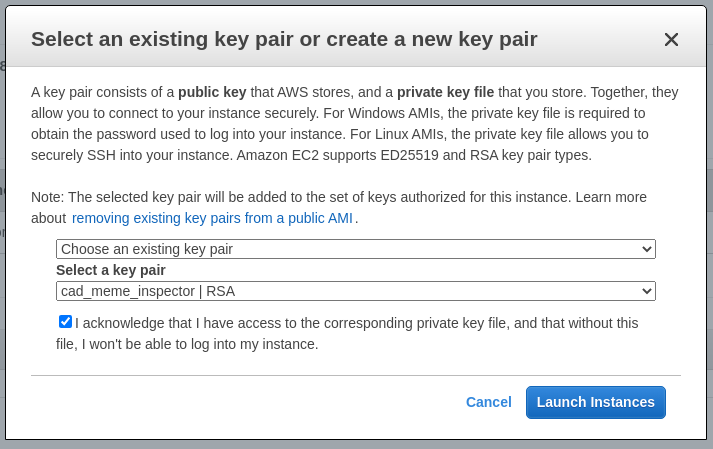

# Meme Inspector
Simple Web Application to tag and store memes and other files and see a list of all uploads with some details like size, mimetype & upload date. All file types are accepted and there is no limit in file size.

Operating System: Runs on linux and mac.

Programming language: Meme Inspector is written in pure JavaScript (ES2015), HTML5 & CSS2 

Frontend Framework: We used [Svelte](https://svelte.dev/) 3.0.0 for the frontend, "a radical new approach to building user interfaces. Whereas traditional frameworks like React and Vue do the bulk of their work in the browser, Svelte shifts that work into a compile step that happens when you build your app.".
The application was tested in Chrome Version 94.0.4606.61, Safari 14.1.2, Brave Version 1.30.87 based on Chromium Version 94.0.4606.71.

Runtime and Webserver: For the backend we used [Node.js](https://nodejs.org/en/) Version 16.10.0, "a JavaScript runtime built on Chrome's V8 JavaScript engine" and [ExpressJS](https://expressjs.com/), a "Fast, unopinionated, minimalist web framework for Node.js".

Persistence: The files are stored on the server hard drive. Informations about the memes are stored in MongoDB. 
"MongoDB’s document data model naturally supports JSON and its expressive query language is simple for developers to learn and use." Tested with MongoDB Version 5.0.3 Community Edition.

---

To run the App locally:

1. Build the frontend: `cd frontend && npm i && npm run build`
2. Build the backend: `cd ../backend && npm i`
3. Have a mongodb server running locally with following settings:
   - address: `mongodb://localhost:27017` (default)
   - database: `meme_inspector`
   - collection: `memes`
4. Run the backend (serving the frontend): `npm run watch`
5. Go to [http://localhost:3000](http://localhost:3000)

## Deployment of Image
This project uses [AWS EC2](https://eu-central-1.console.aws.amazon.com/ec2/v2/home?region=eu-central-1#Instances:).
Below are the steps taken to use the meme-inspector image.

